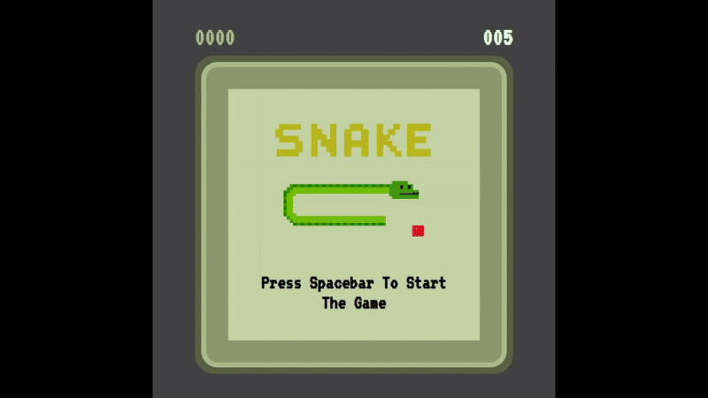

# 🐍 Snake Game
[](https://developer.mozilla.org/en-US/docs/Web/Guide/HTML/HTML5)
[](https://developer.mozilla.org/en-US/docs/Web/CSS)
[](https://developer.mozilla.org/en-US/docs/Web/JavaScript)
[](https://en.wikipedia.org/wiki/Snake_(video_game_genre))


A classic Snake Game built using HTML, CSS, and JavaScript. <br>
The game uses grid-based rendering, event-driven input handling, and dynamic speed scaling to provide a smooth and challenging gameplay experience. <br>

Move the snake around the board, eat food to grow longer, and try to beat your high score! <br>

<br>

---


## 🎮 Features
- ✅ Smooth real-time movement system using a JavaScript game loop (setInterval)
- ✅ Supports Arrow keys and WASD for flexible player controls
- ✅ Progressive difficulty – snake speed dynamically increases as it eats food
- ✅ Collision detection for walls and self-body (game over handling)
- ✅ High Score persistence with localStorage across sessions
- ✅ Dynamic rendering of snake and food using DOM manipulation on a 20×20 grid
- ✅ Event-driven input handling for instant and responsive controls
- ✅ Algorithmic complexity in movement, growth, collision logic, and adaptive speed scaling
- ✅ Retro-themed pixel-style design with layered borders
  
<br>

---

## 🚀 How to Play

1. Press Spacebar to start the game.
2. Use Arrow keys or WASD to move the snake:
   - ⬆️ / W → Up
   - ⬇️ / S → Down
   - ⬅️ / A → Left
   - ➡️ / D → Right
3. Eat food ⬜ to grow longer.
4. Avoid colliding with walls or yourself.
5. Try to beat your High Score!

<br>

---

## 🎬Demo

<p align="center">
  
</p>

Check out the live Snake Game here 👉 [Play Snake Game](https://thinal-fernando.github.io/snake-game/)


<br>

---

## ⚡ Getting Started

```bash
# Clone the repository:
git clone https://github.com/your-username/snake-game.git

# Open index.html in your browser.
```
Enjoy the game! 🎉

<br>

---

## 🛠️ Tech Stack
- HTML5 – Game structure
- CSS3 – Styling and layout
- JavaScript – Game logic, rendering and interactions

<br>


⭐ Feel free to contribute, fork, or open issues to improve this project.


